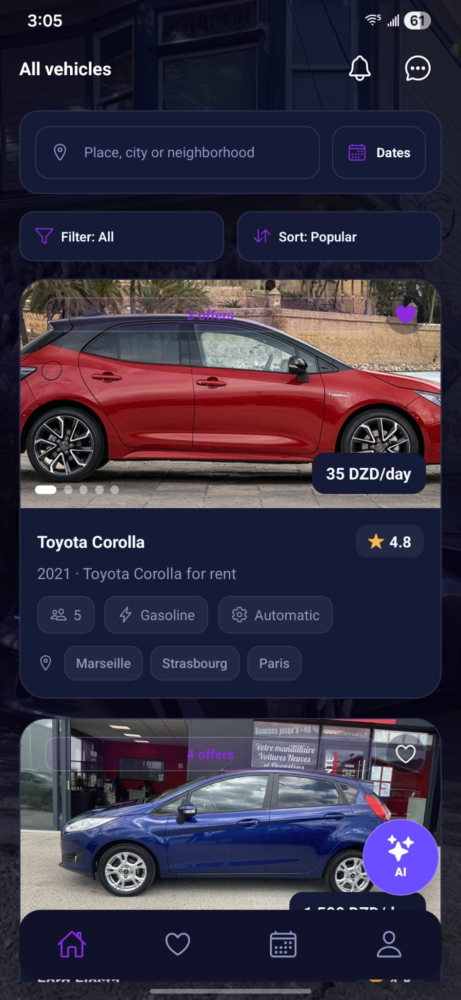
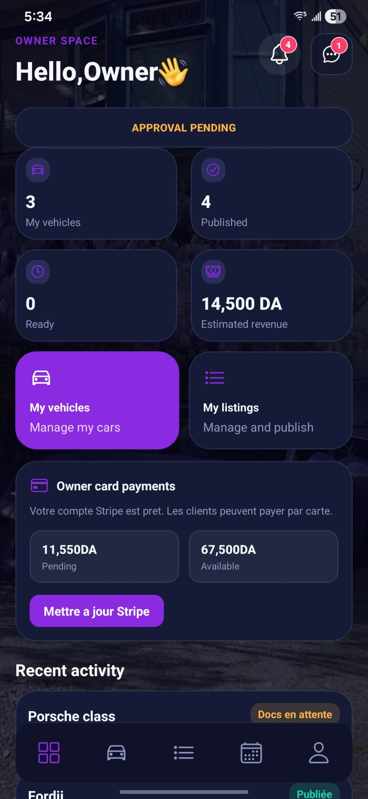
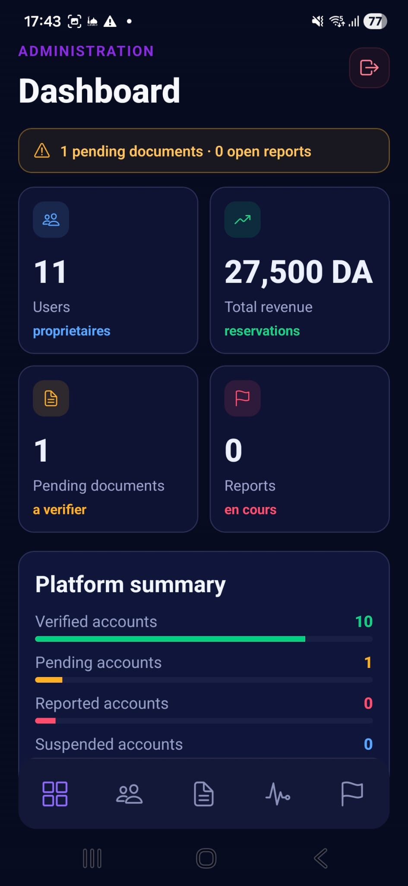
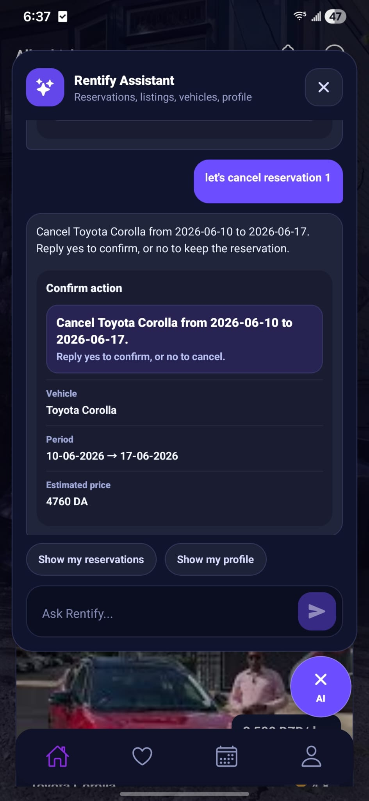
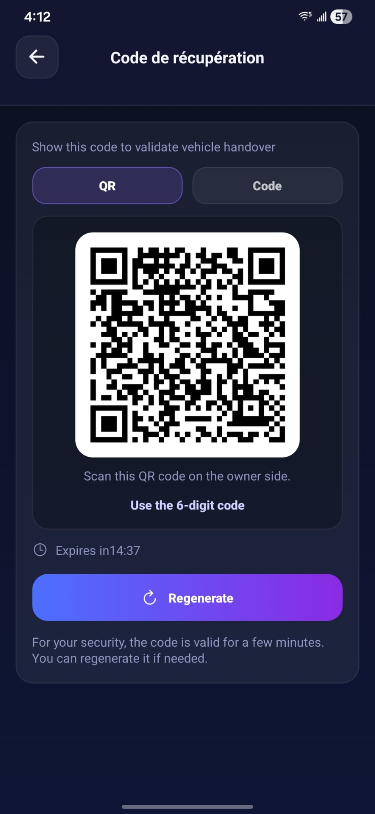
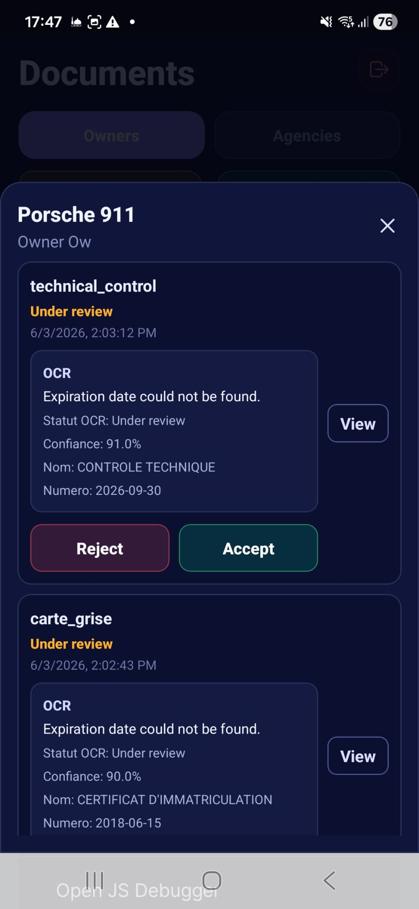

# Rentify - Peer-to-Peer Vehicle Rental Marketplace


**A mobile marketplace connecting vehicle owners, rental agencies, and customers through a secure and intelligent rental platform.**

[Features](#-features) • [Technology Stack](#-technology-stack) • [Architecture](#-software-architecture) • [Installation](#-installation) • [Documentation](#-documentation)

---

## 👨‍💻 Developers

* **Neila KRIKA** — M1 Informatique Mobile, UHA (FST)
* **Thanina SEGHILANI** — M1 Informatique Mobile, UHA (FST)

---

## 📖 Project Overview

Rentify is a cross-platform mobile application that enables vehicle rentals between private owners, rental agencies, and customers.

The platform provides:

* Secure online payments
* Escrow-based transaction management
* Real-time communications
* AI-assisted vehicle search
* Automated identity verification through OCR
* Agency and vehicle management

The backend follows a Domain-Driven Design (DDD) architecture to ensure maintainability, scalability, and separation of concerns.

---

## 📱 Application Overview

---

## 🚀 Features

### User Features

* User registration and authentication
* Vehicle browsing and advanced filtering
* Booking management
* Favorites system
* Real-time notifications
* Secure messaging

### Vehicle Owners

* Vehicle listing management
* Availability calendar
* Booking approval workflow
* Revenue tracking

### Rental Agencies

* Agency profile management
* Fleet management
* Agency verification process

### Smart Services

* AI-powered vehicle recommendation (Google Gemini)
* OCR-based identity verification (Tesseract.js)
* Automated document analysis

### Payments

* Stripe Connect integration
* Secure online payments
* Escrow fund management
* Automatic commission distribution

---

## 🛠 Technology Stack

### Mobile Application

* React Native
* Expo
* Socket.io Client

### Backend

* Node.js
* Express.js
* PostgreSQL
* Supabase

### Cloud & External Services

* Stripe Connect
* Cloudinary
* Google Gemini API
* Tesseract.js

---

## 📐 Software Architecture

The backend follows a layered architecture inspired by Domain-Driven Design principles.

### Layers

#### Routes

Handle incoming HTTP requests and route them to the appropriate controllers.

#### Controllers

Validate request data, manage responses, and handle HTTP status codes.

#### Services

Contain all business logic and orchestrate interactions between models and external services.

#### Models

Provide access to PostgreSQL data through Supabase.

### Simplified Architecture

```text
Client (React Native)
        │
        ▼
      Routes
        │
        ▼
   Controllers
        │
        ▼
     Services
        │
 ┌──────┴──────┐
 ▼             ▼
Models     External APIs
 │          (Stripe, Gemini,
 ▼           Cloudinary, OCR)
PostgreSQL
```

---

## 📂 Project Structure

```text
project/
│
├── front/          # Mobile application
├── back/           # Backend API
├── docs/           # Documentation
└── assets/         # Images and screenshots
```

---

## 📦 Installation

### Prerequisites

* Node.js v18+
* npm
* Expo CLI

### Clone the repository

```bash
git clone https://github.com/your-account/rentify.git
cd rentify
```

### Backend

```bash
cd back
npm install
npm start
```

### Frontend

```bash
cd front
npm install
npx expo start
```

---

## ⚙️ Environment Variables

Create a `.env` file inside the backend directory:

```env
SUPABASE_URL=
SUPABASE_KEY=

STRIPE_SECRET_KEY=
STRIPE_WEBHOOK_SECRET=

CLOUDINARY_CLOUD_NAME=
CLOUDINARY_API_KEY=
CLOUDINARY_API_SECRET=

GEMINI_API_KEY=
```

---

## 📚 Documentation

### API Documentation (Swagger)

https://rentify-yj6i.onrender.com/api-docs/

---

## 🔒 Security

* JWT Authentication
* Secure password hashing
* Stripe PCI-compliant payment processing
* OCR-based identity verification
* Escrow payment protection

---

## 📸 Application Screenshots

<p align="center">
  
  
  
</p>

<p align="center">
  
  
  
</p>


## 📄 License

This project is intended for academic and educational purposes.
